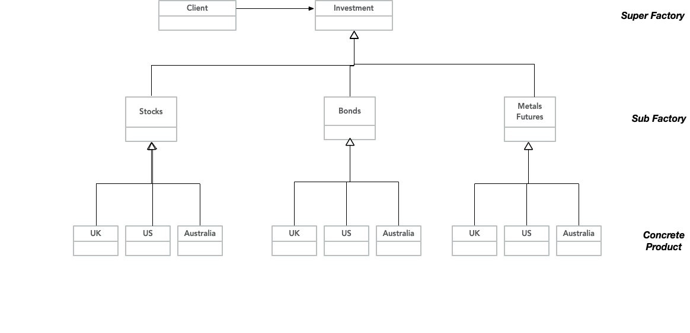

#### 3.1. What creational pattern is being used in `CloudServer`? Is it correctly implemented? Why or Why not? Could you implement it differently? Justify accordingly with sufficient explanations.  

**_WRITE YOUR ANSWER HERE_**

The creational pattern is being used in “`CloudServer`”? is a Singleton Design pattern because:

- It declares a private static variable of the same class that represents an instance of the class.

- It declares a private constructor to restrict the instantiation of a class from other classes.

- It declares the static method “`getInstance()`” that Returns the same instance of its own class.

- The “`getInstance()`” method is the only way of accessing [“getting”] the singleton object.

It is not correctly implemented because:
- The static property of this class:

    - Is declared as final;

    - It is declaring a new instance of the singleton class, when that should be called in the “getInstance()” method,

- The “`getInstance()`” method should on the first Time this message is called it creates a instance of the “`CloudServer`” singleton, but on subsequent calls it just returns an instance of the “CloudServer” singleton.

To correctly implement this:
- Declare the static property of the class as

`private static  CloudServer INSTANCE ;`

Instead of:

`private static final CloudServer INSTANCE = new CloudServer();`

- Redefined the implementation of the  `“getInstance()`” method  as

  	`//---------------------------------------------------------------------`

  `  	public static CloudServer getInstance()`

  `{`

  	if (INSTANCE == null)
        
  	{
            
  	INSTANCE = new CloudServer();
        
  	}
        
  	return INSTANCE;

	`}// close public static CloudServer getInstance() method`

Instead of:

    //---------------------------------------------------------------------
    public static CloudServer getInstance()
    {
        return INSTANCE;

    }// close public static CloudServer getInstance() method

- For the implementation of this please refer to “CloudServer.java” in the “task3.refactored” package.

  

#### 3.2 Not all Builders must construct visual objects. What might you use a Builder to construct? Why? Find a real-world example and explain why it is correct using it there. Your answer should have at least 500 words _without_ the code snippet.

_**WRITE YOUR ANSWER HERE**_

What is the builder design pattern?  It is a software design pattern that allows the construction of complex objects to be separated from their presentation, separating the construction of a complex object from its representation. The builder pattern provides a way to create complex objects step-by-step, by separating the construction of each part into individual methods. Each method handles the creation of a specific part of the object, and returns a reference to the builder object, which can be used as a chain of creation, that all subsequent parts attached to. The main advantage of the builder-pattern is that it provides a scalable and flexible approach for creating complex objects, while simplifying the construction process, and making it maintainable.

the builder design pattern operates by a client Application initiating the construction of the resultant product object, by creating an instance of the concrete builder and then passing it to the Director [if it is present]…

[ Wait ! Some background : the concrete builder  is the implementation of the builder Interface that provides the implementation for the creation of the resultant object Product. The builder is the Interface that defines the method (steps) to create the  product object. The product is the resultant object that will be created by the builder design pattern. Finally the is an optional component that controls the order of the steps to create the resultant product object ]

Next, the client then calls the methods on the builder object to create the various parts of the resulting product object. Each method of the builder object returns a reference to the builder object, which is then used to chain the creation of the resultant product object parts. Once the parts are created, the client can then call a final method on the concrete builder class to assemble the parts into the final resultant product object. The final resultant object then returned to the client.

What might you use the builder design pattern to construct?

It can be used to build Products that have a visual component to it, such as an application user interface, the presentation of content in a webpage, or non-visual applications such as building a database query or saving A Microsoft Word document as a text file.

It can be used to build the user interface elements of a resultant product such as a web browser application consist of many components such as tabs, buttons, forms etc., In addition  it may also be used to build a particular webpage. This webpage may consist of It may consist of text, table headers, table rows, and/or chart data. The concrete builder can implement these components by creating the relevant HTML, or *.CSS elements. The director can provide a default order of these components, or allow the client to specify the order, and for a webpage the client web browser.

You can use the Builder design pattern to build database queries in an application. The query Builder interface can define the different components of a query such as SELECT, WHERE, and JOIN. The concrete builder can implement these components by creating the necessary SQL The Director can provide a default order of these components or allow the client to specify that order.

In Microsoft Word, a MS Word document can be saved as an HTML, XML, PDF, or TXT plain text files. Consider saving an MS wood document as a TXT plain text file. the builder design pattern: has a reader object that reads the tokens from the Microsoft word document, and the reader class that reads each component from the work document for example BOLD_STARTED, UNDERLINE_STARTED, WORDS_STARTED etc. It creates a builder interface method that response to the different tokens from the Microsoft word document. If you have chosen to save the word document as a plain text TXT file, The application would choose the plain TXT file builder from the Microsoft Word document tokens, and implement the builder interface. This Builder does not need to respond to all the tokens that are handled by the word document, or in another way of explaining this, this plain TXT build a implementation provides no implementation for BOLD_STARTED, UNDERLINE_STARTED etc. However the Plain TXT file builder information does need to implement WORDS_STARTED because in this plane text file or we will have is plain words without formatting such as bold or underline. Finally it will pass the “Plain TXT File Builder Implementation” and a builder interface to the reader object. As part of this It will call the appropriate methods in a “CASE <<CONDITION>> SWITCH” statement for each token.
That's probably something to do

  

#### 3.3. If you are writing a program to track investments (namely: stocks, bonds, metal futures) in multiple countries (namely: Australia, US, UK), how might you use an _abstract factory_? Why? Complement your answer with a Class Diagram. You _must_ add it to the Answer file using markdown. Save it inside the `task3` folder.

WRITE YOUR ANSWER HERE

With this requirement, the relevant architecture for this requirement is best illustrated by the following class diagram...

In this requirement we are developing an application that will track different types of investments that would be subject to different country requirements. This this means they can be a problem of representing a family of products and their dependencies without specifying their concrete classes. The abstract factory design pattern is similar to the factory design pattern but has an additional layer of abstraction over the factory pattern.

As a result the choice was to represent  the investment application that managers the different investment products as either stocks, Bonds, or metal futures. Because for each investment product there may be different business rules objects applicable in each different country which are UK, US, and Australia. As a result it is best to represent this as a hierarchy that consists of at the highest level the investment  Manager application, as the super factory, and each investment product abstracted as a sub factory, that is further abstracted Down to the particular concrete product, that is differentiated by the particular Country business object. External to the investment manager application is a client Application that send request to the investment manager.
